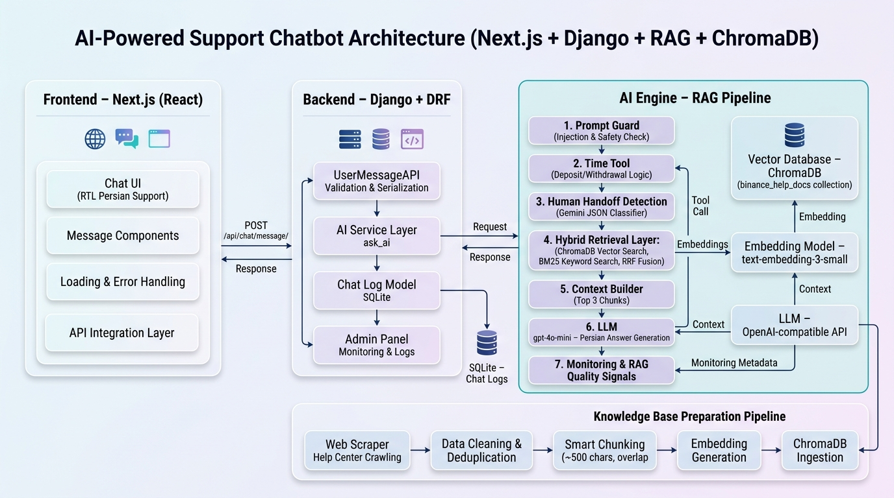

<p align="center">
  
</p>

# AI-Powered Support Chatbot

A production-oriented support chatbot stack built with **Next.js**, **Django REST Framework**, and a **RAG pipeline backed by ChromaDB**. The system provides a Persian RTL chat experience, routes user messages through a validated backend API, retrieves relevant knowledge-base context, and generates concise support answers through an OpenAI-compatible LLM provider.

## Flowchart Overview

The user sends a message from the Next.js chat UI to the Django API. Django validates and logs the request, calls the AI service, and the RAG pipeline applies prompt safety checks, optional tool/human-handoff logic, hybrid retrieval from ChromaDB + BM25, context building, LLM generation, and monitoring signals before returning the final answer to the UI.

## Key Features

- **RTL Persian support UI** built with Next.js and React.
- **Django + DRF backend** with request validation, response timing, and chat logging.
- **RAG answer generation** using ChromaDB vector search, BM25 keyword search, and Reciprocal Rank Fusion.
- **Prompt guardrails** for injection and safety checks before retrieval and generation.
- **Human handoff detection** for queries that should not be handled automatically.
- **Tool calling support** for transaction-time related questions.
- **RAG quality monitoring** stored alongside chat metadata for observability.
- **Knowledge-base preparation scripts** for scraping, cleaning, chunking, embedding, and ingestion.

## Architecture

| Layer | Responsibility |
| --- | --- |
| Frontend | Persian RTL chat interface, message state, loading/error states, and API integration. |
| Backend | DRF endpoint, serializer validation, AI service orchestration, SQLite chat logs, and admin monitoring. |
| AI Engine | Prompt guard, time tool, handoff classifier, hybrid retrieval, context builder, LLM call, and quality signals. |
| Vector Store | Persistent ChromaDB collection containing embedded support-document chunks. |
| Data Pipeline | Help-center crawling, cleaning, deduplication, smart chunking, embedding generation, and ChromaDB ingestion. |

## Repository Structure

```text
.
├── AI/                         # RAG pipeline, guardrails, tools, monitoring, data scripts
│   ├── chroma_db/              # Persistent ChromaDB vector store
│   ├── Data/                   # Source and processed knowledge-base files
│   ├── llm.py                  # Main AI response pipeline
│   ├── prompt_guard.py         # Prompt safety validation
│   ├── human_handler.py        # Human handoff classifier
│   ├── rag_monitor.py          # Retrieval/answer quality signals
│   └── time_tool.py            # Transaction-time tool logic
├── backend/                    # Django + DRF API
│   ├── chat/                   # Chat endpoint, models, serializers, services
│   └── manage.py
├── frontend/                   # Next.js chat UI
│   ├── app/
│   ├── components/
│   └── public/chart.PNG        # Architecture diagram used in this README
├── requirements.txt            # Python dependencies
└── README.md
```

## Requirements

| Tool | Version | Purpose |
| --- | --- | --- |
| Python | 3.11+ recommended | Django API and AI pipeline |
| Node.js | 20+ recommended | Next.js frontend |
| npm | Latest stable | Frontend dependency management |

## Environment Variables

Create the AI environment file:

```bash
cp AI/.env.example AI/.env
```

Then configure:

| Variable | Description |
| --- | --- |
| `METIS_API_KEY` | API key for the OpenAI-compatible provider. |
| `METIS_OPENAI_BASE_URL` | Base URL used by the OpenAI SDK client. |
| `METIS_REST_API_ENDPOINT` | REST endpoint used by the handoff/classification flow. |

Optional frontend/backend configuration:

| Variable | Description |
| --- | --- |
| `NEXT_PUBLIC_API_ORIGIN` | Frontend API origin, for example `http://127.0.0.1:8000`. |
| `DJANGO_CORS_ALLOWED_ORIGINS` | Comma-separated allowed frontend origins for Django CORS. |

## Backend Setup

From the repository root:

```bash
python3 -m venv .venv
source .venv/bin/activate
pip install --upgrade pip
pip install -r requirements.txt
```

Run the Django API:

```bash
cd backend
python manage.py migrate
python manage.py runserver
```

The API will be available at:

```text
http://127.0.0.1:8000/
```

## Frontend Setup

Open a second terminal from the repository root:

```bash
cd frontend
npm install
npm run dev
```

Open:

```text
http://localhost:3000
```

If the frontend cannot reach the backend, set the API origin before starting Next.js:

```bash
export NEXT_PUBLIC_API_ORIGIN=http://127.0.0.1:8000
npm run dev
```

## API Usage

Send a chat message to the backend:

```bash
curl -X POST http://127.0.0.1:8000/api/chat/message/ \
  -H "Content-Type: application/json" \
  -d '{"message":"زمان برداشت تومانی چقدر است؟"}'
```

Example response shape:

```json
{
  "question": "زمان برداشت تومانی چقدر است؟",
  "answer": "...",
  "handoff_required": false,
  "handoff_reason": null,
  "processing_time_ms": 1234
}
```

## Vector Database

The answer pipeline expects a persistent ChromaDB database at:

```text
AI/chroma_db/
```

with the collection:

```text
binance_help_docs
```

If the vector database is missing, build it with the project data-preparation scripts or provide a ready ChromaDB directory before running chat requests.

## Knowledge-Base Pipeline

The included AI scripts support the knowledge-base preparation flow shown in the architecture diagram:

1. Crawl help-center content.
2. Clean and deduplicate records.
3. Split content into compact chunks with overlap.
4. Generate embeddings with `text-embedding-3-small`.
5. Ingest embedded chunks into ChromaDB.

Relevant scripts live under `AI/`, including `scrap/`, `cleanData.py`, `dropContentDuplicate.py`, `chunck.py`, and `embed.py`.

## Operational Notes

- Chat logs are stored in Django's SQLite database through the `ChatLog` model.
- Handoff decisions and RAG monitoring metadata are saved with each chat log entry.
- The default backend CORS configuration allows `localhost:3000` and `127.0.0.1:3000`.
- The frontend defaults to `http://127.0.0.1:8000/api/chat/message/` in development.

## Quick Start

```bash
# Backend
python3 -m venv .venv
source .venv/bin/activate
pip install -r requirements.txt
cp AI/.env.example AI/.env
cd backend
python manage.py migrate
python manage.py runserver

# Frontend, in another terminal
cd frontend
npm install
npm run dev
```

Then visit `http://localhost:3000` and start chatting.
